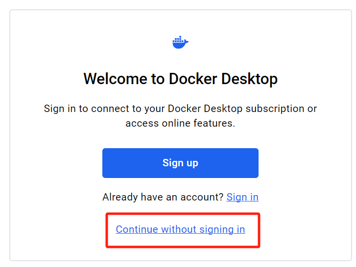
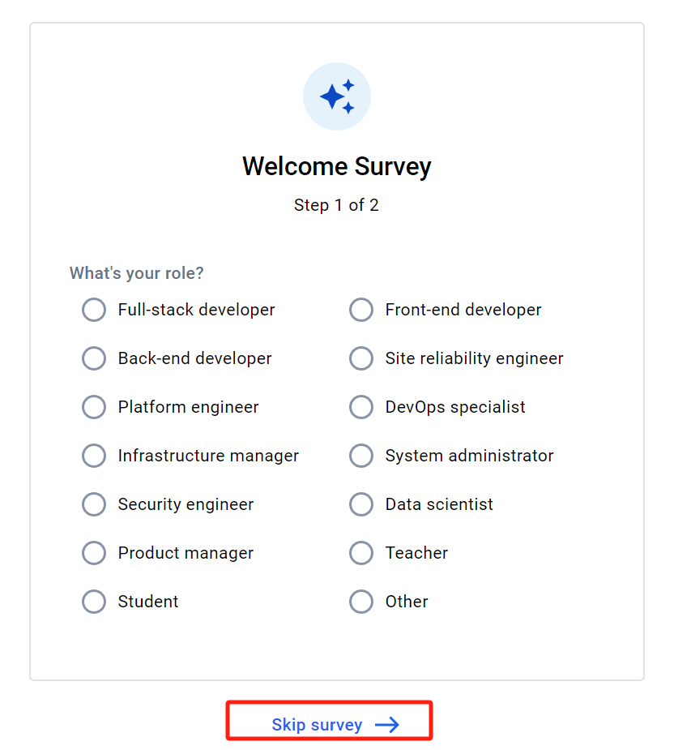
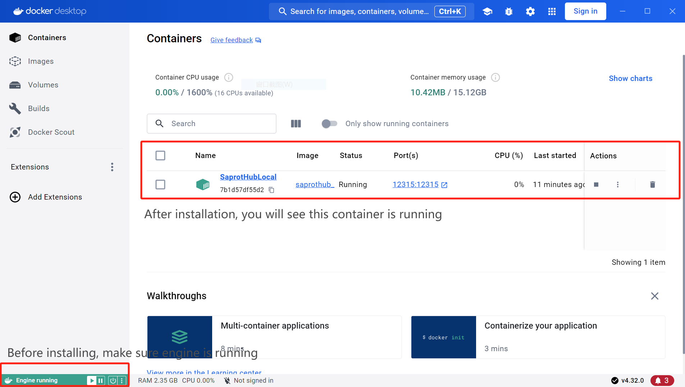
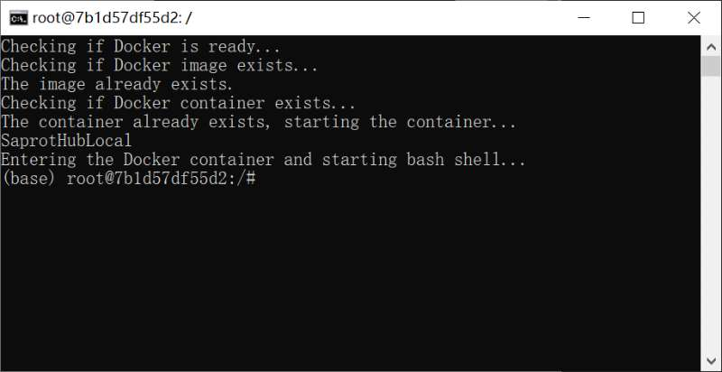
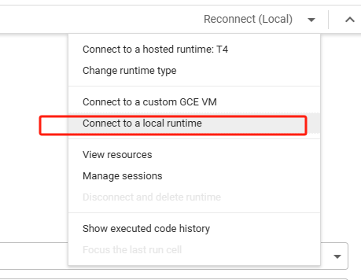
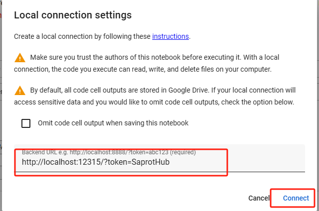

## Deploy ColabSaprot on local server
For users who want to deploy ColabSaprot on their local server, please follow the instructions below:

## For Linux OS

### Step1: Install the environment
```
cd local_server # This is important because the system will find files using relative path!
bash install.sh
```

### Step2: Start jupyter notebook
```
bash run.sh
```

### Step3: Connect to local server on the colab platform
See [here](#connect-to-local-server-on-the-colab-platform).

## For Windows

### Step1: Preparation
1. [Download](https://huggingface.co/datasets/lxzcpro/SaprotHubWindowsDeploy/tree/main) **SaprotHubImage.tar** and **WindowsDeploy.bat** in one folder.
2. Make sure you have installed [Docker Desktop](https://desktop.docker.com/win/main/amd64/Docker%20Desktop%20Installer.exe) and it **is started**





### Step2: Installation
Click the WindowsDeploy.bat until the Ubuntu bash shell is shown like the figure below



### Step3: Start jupyter notebook
Entering the commands below into the bash shell
```
cd ~/SaprotHub/local_server
bash run.sh
```

### Step4: Connect to local server on the colab platform
See [here](#connect-to-local-server-on-the-colab-platform).

## Connect to local server on the colab platform
Open the [SaprotHub.ipynb](https://colab.research.google.com/github/westlake-repl/SaprotHub/blob/main/colab/SaprotHub.ipynb) and click
``Connect to a local runtime``, then input the address of the local server: ``http://localhost:12315/?token=SaprotHub``.





### (Optional) SSH port forwarding
If the GPU is deployed on your remote server, you can use SSH port forwarding to connect to the local server. 
```
ssh -NL 12315:localhost:12315 user@remote_server
```
After that, you can connect to the local server on the colab platform.
